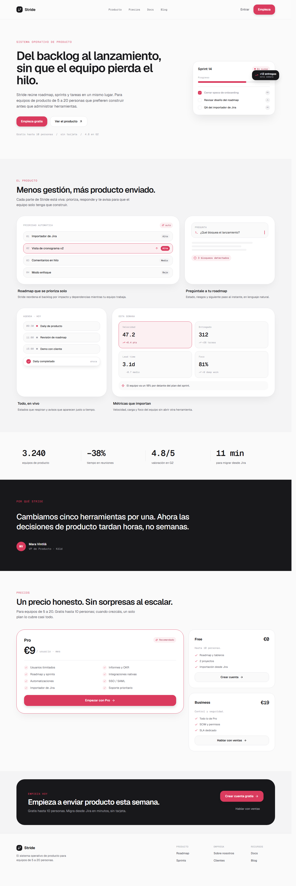

# Stride — Landing

Landing de producto SaaS (**Stride**, un gestor de roadmap/sprints/tareas)
generada a partir del diseño Pencil _Design-Taste_. Construida con **Astro** y
**Tailwind CSS v4**, con una arquitectura de componentes atómicos y por
composición.



## Stack

- [Astro 6](https://astro.build/) — output estático
- [Tailwind CSS v4](https://tailwindcss.com/) — configuración CSS-first con
  `@theme` vía `@tailwindcss/vite`
- [Geist / Geist Mono](https://vercel.com/font) — vía `@fontsource-variable`
- Iconos [lucide](https://lucide.dev/) embebidos como SVG inline (sin
  dependencias en runtime)

## Empezar

Requisitos: Node 18+ y [pnpm](https://pnpm.io/).

```bash
pnpm install
pnpm dev      # servidor de desarrollo en http://localhost:4321
pnpm build    # build de producción en ./dist
pnpm preview  # sirve el build de ./dist
```

## Estructura

```
src/
├─ layouts/
│  └─ Layout.astro            # HTML base, fuentes y metadatos
├─ pages/
│  └─ index.astro             # compone todas las secciones
├─ styles/
│  └─ global.css              # @theme con los tokens del diseño
└─ components/
   ├─ ui/                     # átomos reutilizables
   │  ├─ Button · Badge · Card · Icon · Eyebrow
   │  ├─ Logo · Section · SectionHeading · FeatureItem
   └─ sections/               # una sección por componente
      ├─ Navbar · Hero · Features · Stats
      ├─ Quote · Pricing · CTA · Footer
      └─ hero/ · features/ · pricing/ · footer/   # subcomponentes
```

Principios de la arquitectura:

- **Atómica y componible** — las secciones se montan a partir de átomos
  (`Button`, `Card`, `Badge`, `FeatureItem`…) y subcomponentes específicos
  (`SprintCard`, `MetricTile`, `PlanCard`…).
- **Una sección = un componente**, ensamblados en `index.astro`.
- Ningún archivo supera las **200 líneas**.

## Sistema de diseño

Los tokens del diseño están mapeados 1:1 en `src/styles/global.css` con el
bloque `@theme` de Tailwind v4, lo que genera las utilidades correspondientes
(`bg-*`, `text-*`, `border-*`, `rounded-*`, `font-*`):

| Token            | Valor     | Uso                          |
| ---------------- | --------- | ---------------------------- |
| `--color-bg`     | `#FAFAFA` | Fondo de página              |
| `--color-bg-muted` | `#F4F4F5` | Secciones alternas           |
| `--color-surface`| `#FFFFFF` | Tarjetas                     |
| `--color-ink`    | `#18181B` | Texto principal / fondos dark|
| `--color-ink-2`  | `#52525B` | Texto secundario             |
| `--color-ink-3`  | `#A1A1AA` | Texto terciario / muted      |
| `--color-line`   | `#E4E4E7` | Bordes                       |
| `--color-accent` | `#DA3B5E` | Acento principal             |
| `--radius-sm/md/lg/xl` | `10/18/28/40px` | Radios                |

Tipografía: **Geist** (`font-sans`) para UI y **Geist Mono** (`font-mono`) para
etiquetas, métricas y microcopy. Layout responsive con apilado en móvil.

## Nota sobre la instalación (TLS)

Si `pnpm install` falla con `UNABLE_TO_VERIFY_LEAF_SIGNATURE`, tu red intercepta
TLS con un certificado raíz que Node no reconoce. La solución recomendada es
apuntar Node al CA corporativo:

```bash
# opción correcta (mantiene la verificación TLS)
setx NODE_EXTRA_CA_CERTS "C:\\ruta\\al\\ca.pem"
```

Como alternativa rápida y acotada, un `.npmrc` local con `strict-ssl=false`
(no versionado).
